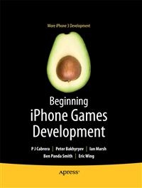

# Apress Source Code

This repository accompanies [*Beginning iPhone Games Development*](http://www.apress.com/9781430225997) by PJ Cabrera, Peter Bakhirev, Ian Marsh, Ben Smith, Eric Wing, Scott Penberthy, Stuart Marsh, and Roderick Smith (Apress, 2010).

Download the files as a zip using the green button, or clone the repository to your machine using Git.

## Releases

Release v1.0 corresponds to the code in the published book, without corrections or updates.

## Contributions

See the file Contributing.md for more information on how you can contribute to this repository.
